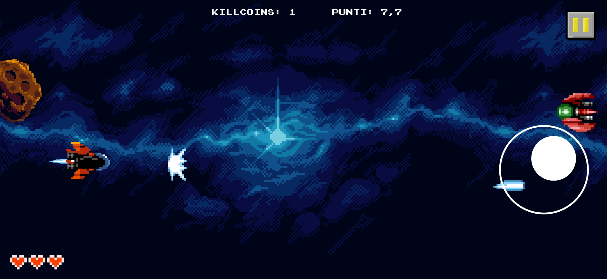

# 2D-pixel-art-space-shooter
Game created during the summer as a personal project to learn how to use Unity. It is a simple 2D pixel art style game where the objective is to hit targets with the spaceship. The player can only control the movement of the spaceship (similar to Jetpack Joyride, but with the difference that the spaceship can move both vertically and horizontally up to half of the screen).

There are two types of enemies:

- Asteroids that follow a fixed diagonal trajectory from the top right to the bottom left.
- Enemy ships that move parallel to the screen from right to left: they initially appear on the screen and then quickly    accelerate to try to collide with the player’s spaceship.
There are also possible waves of enemy ships or swarms of asteroids that occur randomly in the game to make it more challenging.

The player has three lives, and when hit three times, the game ends with an explosion animation. Occasionally, an extra life appears on the screen, moving in a non-uniform sinusoidal pattern, making it difficult to obtain.

Other locations and enemies with different behaviors had already been designed, but I didn't continue the project. Nonetheless, I am very satisfied with what I achieved and learned in such a short time.

________

You can see a photo or video of the gameplay of the game in the files: gameplay_photo.jpg and gameplay_photo.jpg. The apk of the game is available in the release section. 
